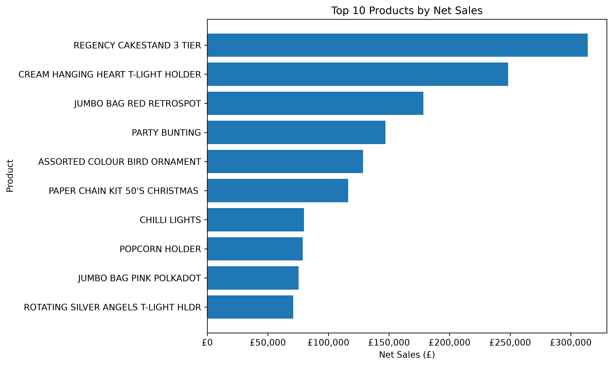
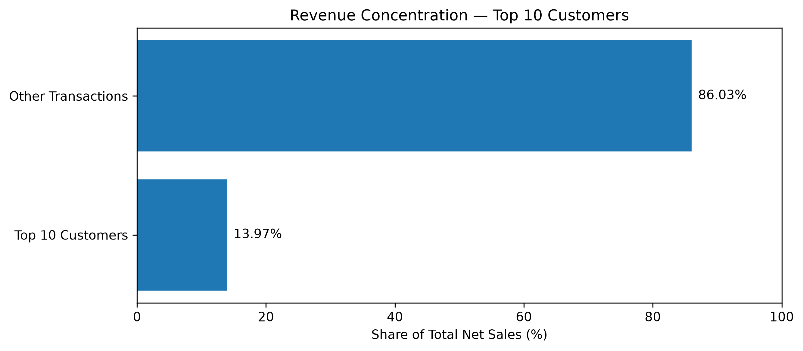

# Online Retail II — Análise de Vendas e Clientes

🌐 **Idiomas:** Português (Brasil) | [English](README.md)

## Visão Geral do Projeto

Este projeto apresenta uma análise exploratória de dados do conjunto **Online Retail II**, que contém transações de varejo realizadas entre dezembro de 2009 e dezembro de 2011.

O objetivo é avaliar o desempenho do negócio por meio da evolução das vendas, da demanda por produtos, do comportamento de compra dos clientes e da concentração de receita. A análise também considera os cancelamentos, distinguindo Vendas Brutas de Vendas Líquidas para oferecer uma visão mais precisa da receita registrada.

O projeto utiliza Python, Pandas e Matplotlib para transformar dados transacionais em informações relevantes para a tomada de decisões de negócio.

## Perguntas de Negócio

1. Como o desempenho das vendas evoluiu ao longo do tempo?
2. Quais produtos geraram a maior receita e o maior volume de vendas?
3. Quem foram os clientes de maior valor e como seus comportamentos de compra se diferenciaram?
4. Quais produtos foram comprados com maior frequência pelos clientes de maior valor?
5. Qual foi o nível de concentração da receita entre os clientes de maior valor e quanto esses clientes contribuíram para as vendas dos produtos mais vendidos?

## Principais Resultados

### Desempenho Geral do Negócio

- **Vendas Brutas (Gross Sales):** aproximadamente **£20,47 milhões**.
- **Valor dos Cancelamentos (Cancellation Value):** aproximadamente **£1,46 milhão**.
- **Vendas Líquidas (Net Sales):** aproximadamente **£19,00 milhões**.

Considerar os cancelamentos permite medir a receita registrada de forma mais precisa do que analisar apenas as Vendas Brutas.

### Desempenho dos Produtos

- **REGENCY CAKESTAND 3 TIER** apresentou o maior valor de Vendas Líquidas, aproximadamente **£314.045**.
- **WORLD WAR 2 GLIDERS ASSTD DESIGNS** liderou em unidades líquidas vendidas, com **104.435 unidades**.
- Nenhum dos 10 produtos com maior volume líquido de unidades vendidas apareceu entre os 10 produtos com maior quantidade de unidades canceladas.
- Dois produtos apareceram tanto entre os 10 maiores em Vendas Líquidas quanto entre os 10 maiores em valor de cancelamentos. Os cancelamentos representaram aproximadamente **5,00%** e **3,64%** das respectivas Vendas Brutas desses produtos.

Esses resultados demonstram por que receita, volume de vendas e cancelamentos devem ser avaliados em conjunto, e não isoladamente.

### Comportamento dos Clientes

- O **cliente 18102** foi o cliente de maior valor, com aproximadamente **£570.381** em gastos líquidos.
- Entre os 10 clientes de maior valor, o produto **REGENCY CAKESTAND 3 TIER** apareceu em **199 notas fiscais distintas**.
- **PACK OF 72 RETROSPOT CAKE CASES** liderou em unidades líquidas compradas por esses clientes, com **20.376 unidades**.

A frequência de compra e o volume de unidades adquiridas oferecem perspectivas diferentes sobre as preferências dos clientes.

### Concentração de Receita

- Os 10 clientes de maior valor geraram aproximadamente **£2,66 milhões**, representando **13,97%** do total de Vendas Líquidas.
- Esses clientes contribuíram com **17,61%** das Vendas Líquidas do produto REGENCY CAKESTAND 3 TIER, em comparação com **3,59%** das Vendas Líquidas do produto CHILLI LIGHTS.

Isso evidencia a importância dos clientes de maior valor e demonstra que sua influência varia consideravelmente entre os produtos.

## Visualizações dos Dados

### Top 10 Products by Net Sales (10 Produtos com Maiores Vendas Líquidas)



**Interpretação de negócio:** O produto REGENCY CAKESTAND 3 TIER apresentou as maiores Net Sales (Vendas Líquidas), com aproximadamente £314.045. Esse resultado demonstra a importância de avaliar o desempenho dos produtos pela receita gerada, e não apenas pela quantidade de unidades vendidas.

### Revenue Concentration — Top 10 Customers (Concentração de Receita — 10 Principais Clientes)



**Interpretação de negócio:** Os dez clientes de maior valor contribuíram com aproximadamente £2,66 milhões, representando 13,97% das Net Sales (Vendas Líquidas) totais. Os 86,03% restantes vieram das demais transações, incluindo aquelas sem Customer ID (Identificador do Cliente). Esse resultado destaca a importância dos clientes de alto valor e contextualiza sua participação na receita total.

## Recomendações de Negócio

- Fortalecer iniciativas de retenção dos clientes de maior valor.
- Considerar tanto a receita quanto a demanda em unidades no planejamento de estoque.
- Adaptar as estratégias de marketing de produtos à frequência de compra e às preferências dos clientes.
- Monitorar a concentração de receita para compreender a dependência dos clientes de maior valor.
- Avaliar os cancelamentos em conjunto com as vendas e investigar separadamente transações com valores de cancelamento excepcionalmente elevados.

## Ferramentas e Tecnologias

- **Python** — análise de dados
- **Pandas** — limpeza, transformação e agregação de dados
- **Matplotlib** — visualização de dados
- **Jupyter Notebook** — análise exploratória e documentação
- **Visual Studio Code** — ambiente de desenvolvimento

## Estrutura do Projeto

```text
online-retail-analysis/
├── data/
│   └── raw/
│       └── online_retail_II.xlsx
├── notebooks/
│   └── online_retail_analysis.ipynb
├── README.md
├── README.pt-BR.md
└── .gitignore
```

## Como Executar o Projeto

**Versão do Python:** Projeto desenvolvido e testado com Python 3.14.3.

1. Clone ou baixe este repositório.
2. Instale o Python e as bibliotecas necessárias:

   ```bash
   pip install pandas matplotlib openpyxl notebook
   ```

3. Abra o arquivo `notebooks/online_retail_analysis.ipynb` no VS Code ou no Jupyter Notebook.
4. Execute as células do notebook na ordem apresentada.

O conjunto de dados está armazenado em `data/raw/`, e o notebook utiliza um caminho relativo para acessá-lo.

## Fonte dos Dados e Atribuição

**Conjunto de dados:** Online Retail II  
**Criador:** Daqing Chen  
**Repositório:** UCI Machine Learning Repository  
**Fonte:** [https://archive.ics.uci.edu/dataset/502/online+retail+ii](https://archive.ics.uci.edu/dataset/502/online+retail+ii)  
**DOI:** [https://doi.org/10.24432/C5CG6D](https://doi.org/10.24432/C5CG6D)  
**Licença:** Creative Commons Attribution 4.0 International (CC BY 4.0)

O conjunto de dados é utilizado para fins educacionais e de portfólio, com atribuição ao seu criador original e ao repositório de origem.